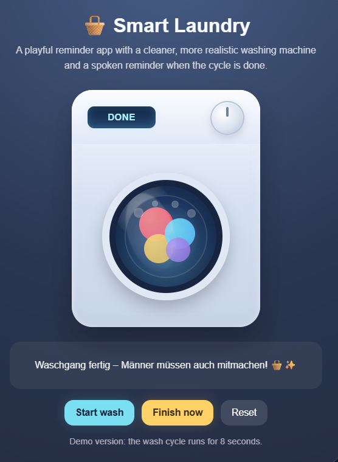

  

# 🧺 Smart Laundry Reminder

A playful interactive laundry reminder built with HTML, CSS and JavaScript.

---

✧ ⟡ ✶ ⟡ ✧

---

## ✨ About
This is a **small, slightly ironic fun project** that turns a simple everyday task into an interactive experience.  

It combines a realistic UI with a touch of humor and personality.

---

✧ ⟡ ✶ ⟡ ✧

---

## ✨ Features
- Realistic washing machine interface  
- Animated drum with colorful laundry  
- Countdown display  
- Start, finish and reset controls  
- Beep sound + spoken message when finished  

---

✧ ⟡ ✶ ⟡ ✧

---

## 💬 Final Message
**Waschgang fertig – Männer müssen auch mitmachen! 🧺✨**

---

✧ ⟡ ✶ ⟡ ✧

---

## 🌐 Live Preview
👉 [Open Smart Laundry Reminder](https://designlili.github.io/smart-laundry-reminder/)

---

✧ ⟡ ✶ ⟡ ✧

---

## 🛠 Built With
- HTML  
- CSS  
- JavaScript  
- Web Speech API  
- Web Audio API  

---

✧ ⟡ ✶ ⟡ ✧

---

## 🎯 Idea
A simple concept:  
Take something ordinary → make it interactive → add personality.

---

✨ <i>Never stop creating.</i> ✨

